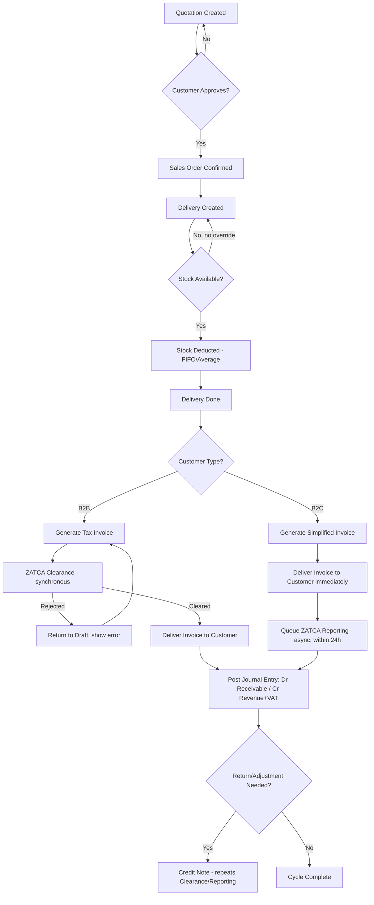
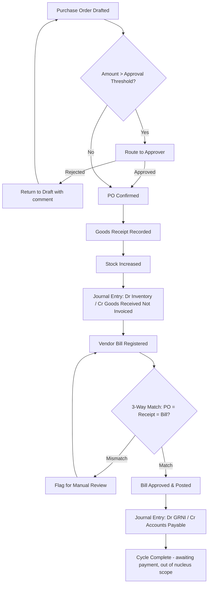
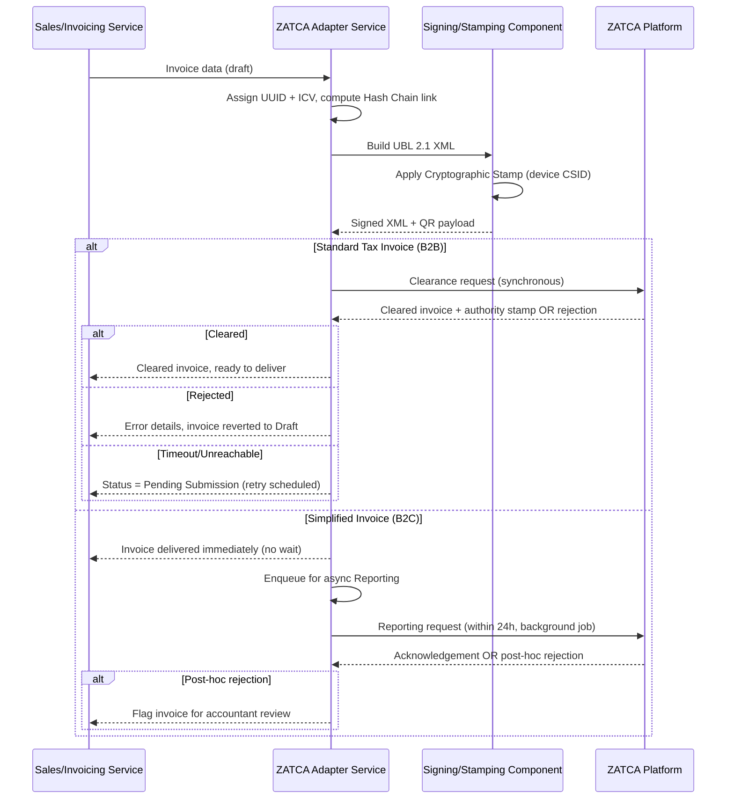
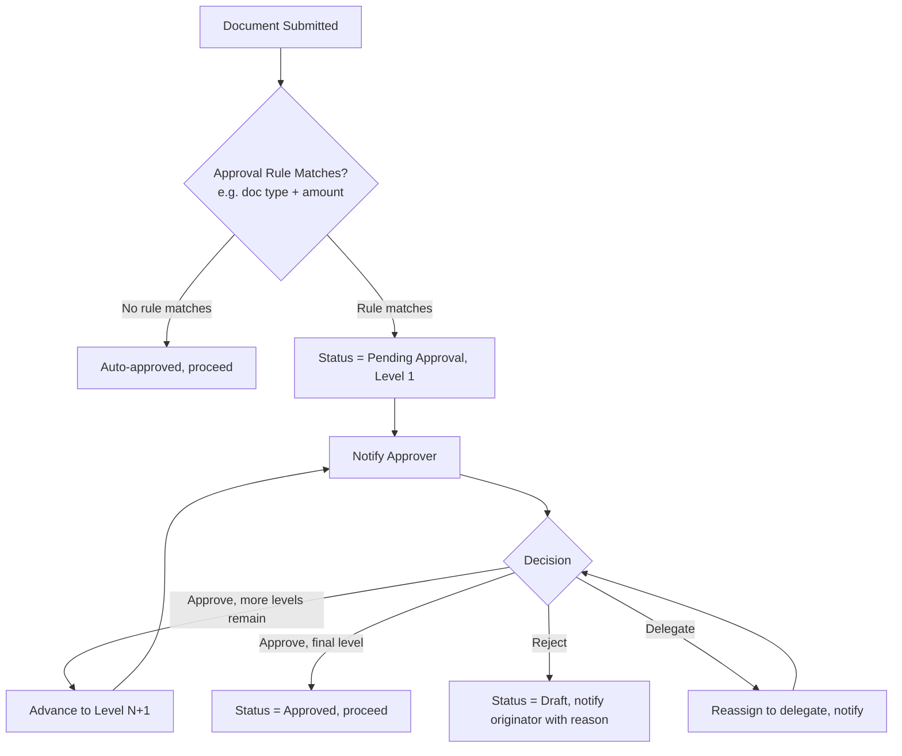

# Phase 5 — Business Flow

**Status:** Draft for approval | **Version:** 0.1
**Builds on:** [04-use-cases.md](04-use-cases.md)

Diagrams use Mermaid syntax (renders on GitHub/most Markdown viewers). Each flow references the use cases it sequences.

---

## 1. Order-to-Cash (O2C)

Sequences UC-SAL-01, UC-SAL-02, UC-SAL-03/04, UC-SAL-05.



**Key control points:**
- Stock cannot go negative without an explicit override (FR-INV-007).
- A Tax Invoice is not legally valid until ZATCA clearance succeeds; a Simplified Invoice is valid at issuance but must still be reported within 24h.
- Every state transition (confirm/deliver/invoice) creates its own journal entry — never a single entry at the end (FR-SAL-007).

---

## 2. Procure-to-Pay (P2P)

Sequences UC-PUR-01, UC-CORE-05 (conditional approval).



**Note:** Payment execution (bank reconciliation, payment runs) is not part of the nucleus FR list; the flow ends at Accounts Payable posting. If needed sooner than the Backlog priority suggests, this should be raised explicitly rather than added silently.

---

## 3. ZATCA Invoice Submission — Detailed Adapter Flow

Expands UC-SAL-03/UC-SAL-04 at the technical/adapter level (informs Phase 8 architecture: this entire flow lives behind a single ZATCA Adapter interface).



**Architectural implication carried to Phase 8:** the rest of the system never talks to ZATCA directly — only through the Adapter's stable interface (`submitInvoice(invoice) -> SubmissionResult`). This satisfies NFR-COMPLY-001 and FR-ZATCA-012 and keeps ZATCA protocol churn contained to one module.

---

## 4. Inventory Valuation Flow (FIFO / Average)

Sequences UC-SAL-02, UC-PUR-01 (receipt), UC-INV-02, informing FR-INV-004/005.

```mermaid
flowchart TD
    A[Stock-affecting Event] --> B{Direction?}
    B -- Inbound - Receipt/Adjustment+ --> C[Add Layer: qty, unit cost, timestamp]
    B -- Outbound - Delivery/Adjustment- --> D{Valuation Method}
    D -- FIFO --> E[Consume oldest layer(s) first, compute weighted cost of issued qty]
    D -- Average --> F[Recompute moving average cost, apply to issued qty]
    E --> G[Stock Move recorded with computed unit cost]
    F --> G
    C --> H[Stock Move recorded with received unit cost]
    G --> I[Journal Entry: Dr COGS / Cr Inventory]
    H --> J[Journal Entry: Dr Inventory / Cr GRNI or Adjustment account]
```

**Design decision required in Phase 7 (Database Design):** the valuation method (FIFO vs Average) is a per-company setting; FIFO requires a stock-layer table, Average requires a running moving-average field per item/location. Both structures should exist in the schema, but only the configured method is active per company (see FR-INV-004).

---

## 5. Approval Workflow (Generic Engine)

Used by UC-CORE-05, invoked conditionally from O2C and P2P flows.



---

## 6. Traceability

| Flow | Governing Use Cases | Governing FRs |
|------|----------------------|-----------------|
| Order-to-Cash | UC-SAL-01..05 | FR-SAL-*, FR-ZATCA-* |
| Procure-to-Pay | UC-PUR-01, UC-CORE-05 | FR-PUR-*, FR-CORE-052 |
| ZATCA Submission | UC-SAL-03, UC-SAL-04 | FR-ZATCA-001..012 |
| Inventory Valuation | UC-INV-01, UC-INV-02, UC-SAL-02, UC-PUR-01 | FR-INV-004, FR-INV-005 |
| Approval Workflow | UC-CORE-05 | FR-CORE-052 |

---

## 7. General Acceptance Criteria

- [ ] Project owner confirms these flows match real-world operating procedure (especially ZATCA Clearance vs Reporting split, and the P2P cutoff at Accounts Payable).
- [ ] Any missing control point or exception path is raised before Phase 6 (ER Diagram), since the ER model is derived directly from these flows' data touchpoints.

---

*End of Phase 5. Proceeding to Phase 6: ER Diagram.*
