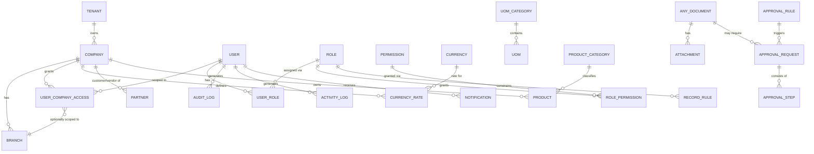
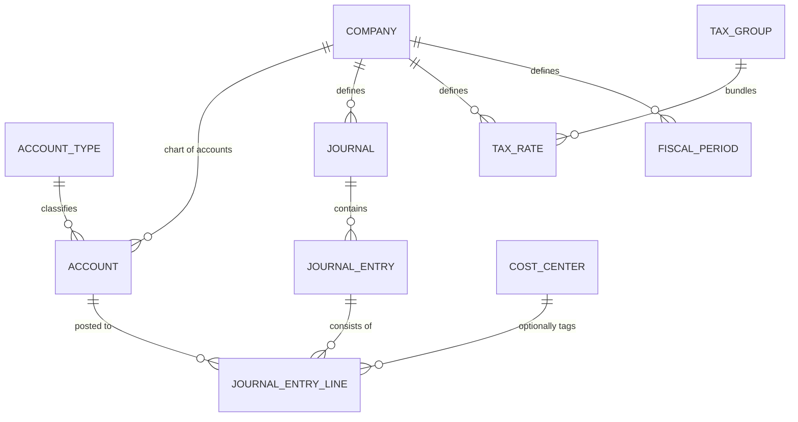
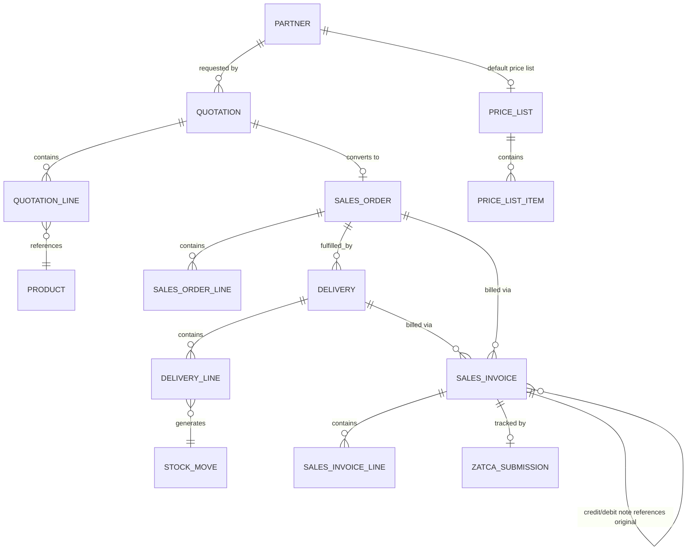
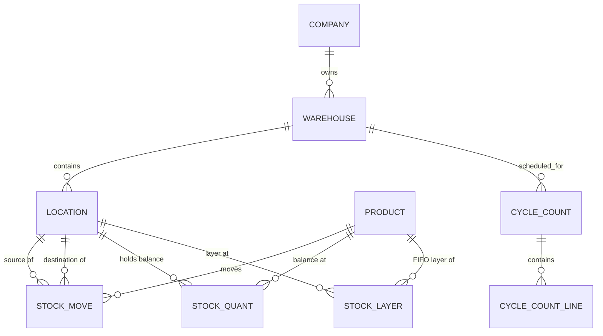
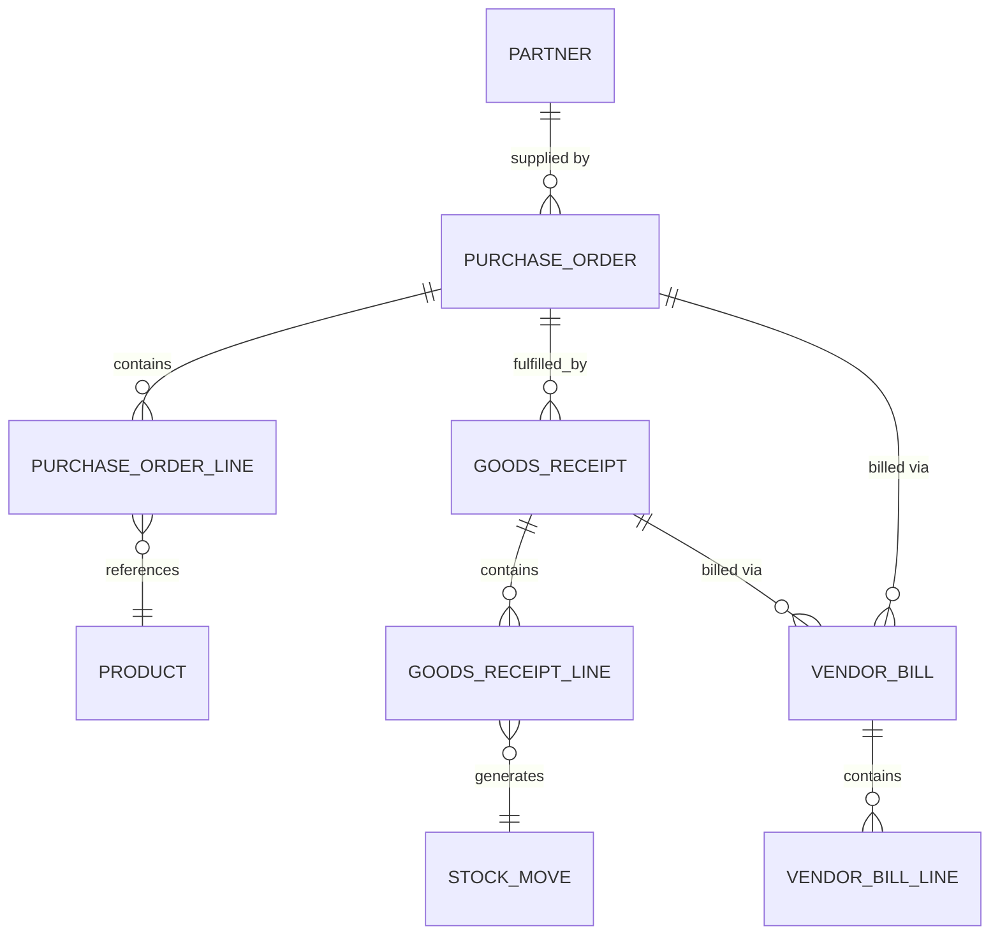

# Phase 6 — ER Diagram

**Status:** Draft for approval | **Version:** 0.1
**Builds on:** [05-business-flow.md](05-business-flow.md)

This phase defines the **conceptual/logical entity model** — entities, attributes at a summary level, and relationships. Physical types, constraints, and indexes are defined in Phase 7 (Database Design).

---

## 1. Cross-Cutting Rule (applies to every entity below, not repeated per-diagram)

Every entity listed in this document implicitly includes the common envelope defined in FR-CORE-020:

`id (UUID, PK)`, `tenant_id`, `company_id`, `branch_id` (nullable where a record is company-wide, e.g. Chart of Accounts), `created_by`, `updated_by`, `deleted_by`, `created_at`, `updated_at`, `deleted_at`, `version`.

These fields are omitted from the diagrams below to keep them readable — see Phase 7 for the full physical column list.

---

## 2. Foundation & Master Data (M0)

| Entity | Purpose |
|--------|---------|
| Tenant | Top-level owner of one or more Companies (supports a holding-group scenario) |
| Company | Legal entity; owns its own Chart of Accounts, currency, tax registration |
| Branch | Physical/operational location under a Company |
| User | System login identity |
| UserCompanyAccess | Which Company/Branch scopes a user can operate in |
| Role / Permission / RolePermission | RBAC bundle |
| RecordRule | Row-level filter condition attached to a Role (e.g. `sales_rep_id = current_user`) |
| AuditLog | Field-level before/after change record |
| ActivityLog | General event stream |
| Partner | Unified customer/vendor contact |
| Product / ProductCategory | Item/service master |
| Currency / CurrencyRate | Currency master and manually-entered exchange rates |
| UoM / UoMCategory | Units of measure and conversion groups |
| Attachment | File attached to any document (polymorphic reference) |
| ApprovalRule / ApprovalRequest / ApprovalStep | Configurable multi-level approval engine |
| Notification | In-app notification queue per user |

> `ANY_DOCUMENT` above is a conceptual placeholder, not a real table — Attachments and Approval Requests reference a specific document type + document ID (polymorphic association), resolved concretely per module in Phase 7.

---

## 3. Accounting (M1)

| Entity | Purpose |
|--------|---------|
| Account | Single chart-of-accounts node (hierarchical via `parent_account_id`) |
| AccountType | Asset/Liability/Equity/Revenue/Expense classification |
| Journal | Named ledger (Sales, Purchases, Bank, Cash, General) |
| JournalEntry | Header of a posted/draft transaction |
| JournalEntryLine | Debit or credit line, references one Account, optional CostCenter |
| CostCenter | Optional cost-tracking dimension |
| TaxRate / TaxGroup | VAT rate definitions and compound groupings |
| FiscalPeriod | Open/closed accounting period boundary |

**Key invariant carried from Phase 2 (FR-ACC-003):** `SUM(JournalEntryLine.debit) = SUM(JournalEntryLine.credit)` per JournalEntry — enforced at the service layer, not just a DB constraint (a DB-level `CHECK` cannot easily aggregate across sibling rows, so this is a Phase 7/11 concern).

---

## 4. Sales & E-Invoicing (M2)

| Entity | Purpose |
|--------|---------|
| Quotation / QuotationLine | Pre-sale offer |
| SalesOrder / SalesOrderLine | Confirmed commitment to sell |
| Delivery / DeliveryLine | Goods-issue document, drives Stock Move |
| SalesInvoice / SalesInvoiceLine | Billing document; `invoice_type` enum: `tax`, `simplified`, `credit_note`, `debit_note`; `original_invoice_id` self-reference for notes |
| ZatcaSubmission | One row per submission attempt: `uuid`, `icv`, `previous_hash`, `invoice_hash`, `qr_payload`, `xml_document`, `status` (pending/cleared/reported/rejected), `zatca_response`, `submitted_at` |
| PriceList / PriceListItem | Customer-specific or category-specific pricing |

---

## 5. Inventory (M3)

| Entity | Purpose |
|--------|---------|
| Warehouse / Location | Hierarchical storage structure |
| StockMove | Every inbound/outbound/transfer event, always references a source document (Delivery, GoodsReceipt, Adjustment, Transfer) |
| StockQuant | Current on-hand balance per Product+Location (denormalized for fast lookup) |
| StockLayer | FIFO costing layer: `qty_remaining`, `unit_cost`, `received_at` — only populated when company valuation method = FIFO |
| CycleCount / CycleCountLine | Physical count session and its per-item discrepancies |

**Design note carried to Phase 7:** Average-cost companies use a `moving_average_cost` field directly on `StockQuant` instead of `StockLayer` rows — both structures exist in the schema per company's `valuation_method` setting (see Phase 5 §4).

---

## 6. Purchasing (M4)

| Entity | Purpose |
|--------|---------|
| PurchaseOrder / PurchaseOrderLine | Commitment to buy |
| GoodsReceipt / GoodsReceiptLine | Goods-in document, drives Stock Move |
| VendorBill / VendorBillLine | Payable document; carries 3-way-match status against PO + Receipt |

---

## 7. Full Cross-Module Relationship Summary

| From | To | Cardinality | Note |
|------|----|-------------|------|
| Company | Branch | 1:N | |
| Company | Account (CoA) | 1:N | Each company owns an independent chart of accounts |
| SalesInvoice / VendorBill | JournalEntry | 1:1 (generated) | Auto-created on posting, per Phase 5 flows |
| StockMove | JournalEntry | 1:1 (generated, when valuation-affecting) | |
| Partner | SalesOrder / PurchaseOrder | 1:N | Same Partner table serves both, `is_customer` / `is_vendor` flags |
| Product | StockMove / QuotationLine / PurchaseOrderLine | 1:N each | Central master referenced across all transactional modules |
| Any transactional document | Attachment | 1:N (polymorphic) | |
| Any transactional document | ApprovalRequest | 0:1 (polymorphic, conditional) | |

---

## 8. General Acceptance Criteria

- [ ] Project owner confirms no required entity is missing for the nucleus scope (M0–M5).
- [ ] The FIFO-vs-Average dual-structure approach (StockLayer vs StockQuant.moving_average_cost) is accepted as the modeling strategy before Phase 7 finalizes physical types.

---

*End of Phase 6. Proceeding to Phase 7: Database Design.*
