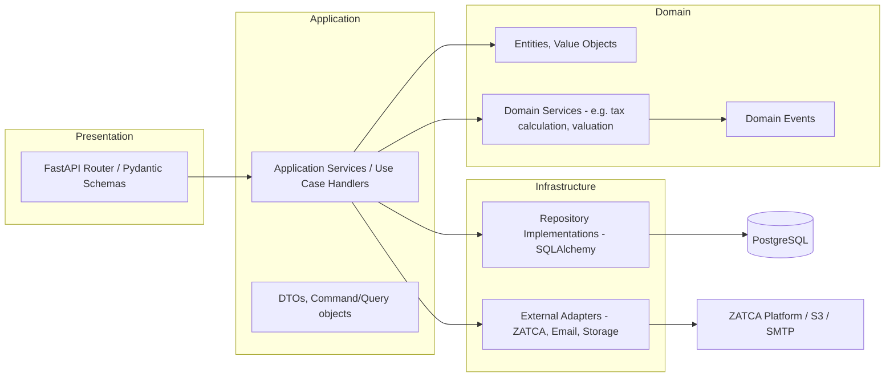
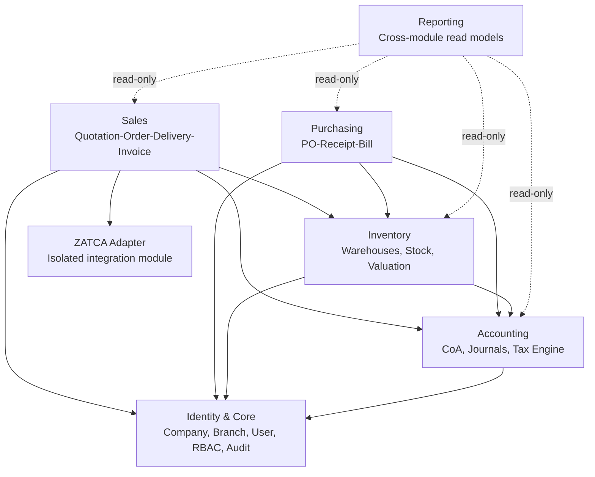
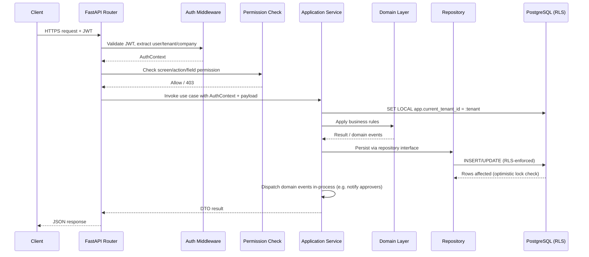
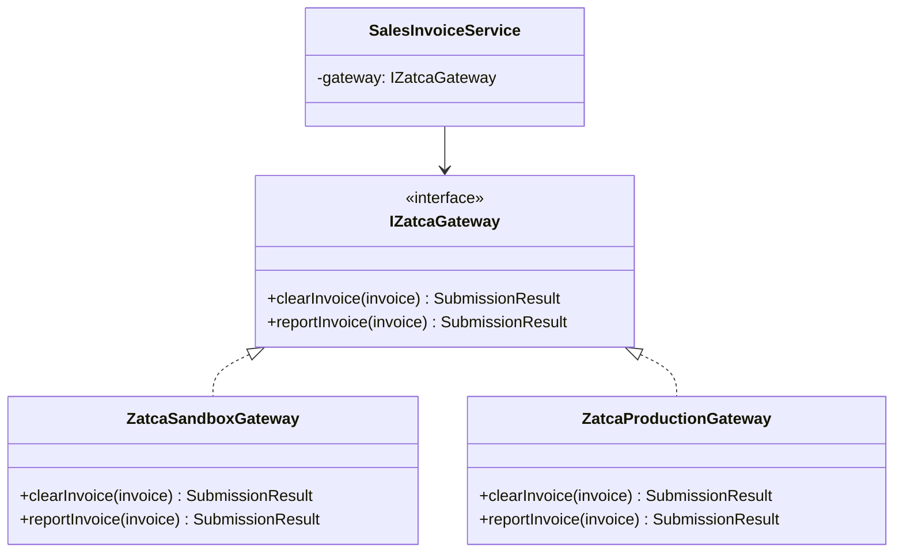
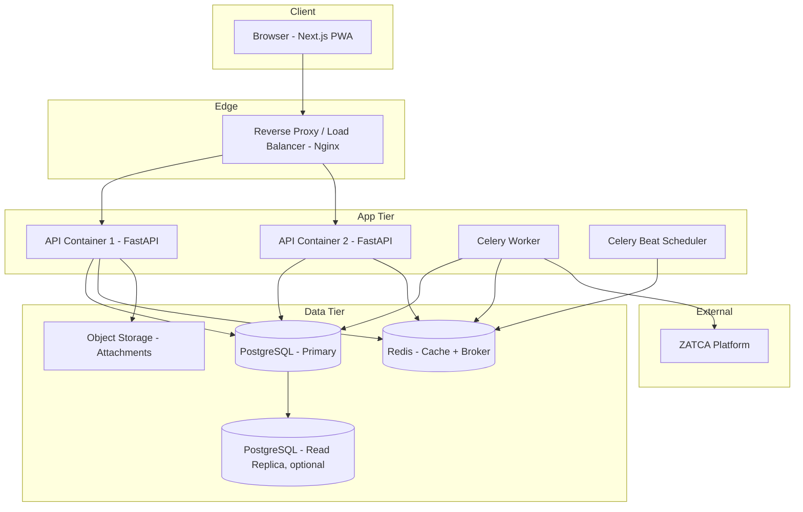

# Phase 8 — System Architecture

**Status:** Draft for approval | **Version:** 0.1
**Builds on:** [07-database-design.md](07-database-design.md), NFR-MAINT-001/006, NFR-SCALE-002 ([03-non-functional-requirements.md](03-non-functional-requirements.md))

---

## 1. Architecture Style

**Modular Monolith**, internally structured as **Clean Architecture / DDD bounded contexts**, deployed as a single backend process (horizontally scaled, stateless) plus a separate worker process for background jobs. This satisfies BO-7 (architectural scalability) without paying the operational cost of real microservices before there's a real scaling need.

Each bounded context = one FR module group from Phase 2: **Identity** (M0), **Accounting** (M1), **Sales** (M2), **ZATCA** (M2, isolated), **Inventory** (M3), **Purchasing** (M4), **Reporting** (M5).

### 1.1 Rule of Module Isolation (enforces NFR-MAINT-002/006)

- A module may depend on another module's **public application-service interface**, never its database tables or domain internals directly.
- Cross-module side effects (e.g., "when an invoice is cleared, notify the user") happen via **in-process domain events**, not direct calls into the other module's internals.
- No module's migration touches another module's tables.

This is the boundary that makes future extraction into real microservices (BO-7) a matter of moving a module + swapping in-process event dispatch for a message broker — not a rewrite.

---

## 2. Layering Per Module (Clean Architecture)

**Dependency rule:** arrows point inward only. Domain has zero dependency on Infrastructure or Presentation — it doesn't import SQLAlchemy or FastAPI. This is what keeps the domain (tax rules, valuation logic, approval logic) testable without a database (supports NFR-MAINT-003's 80% coverage target on business logic).

- **Presentation:** request/response schemas, HTTP concerns, permission-check decorators (FR-CORE-015/016).
- **Application:** orchestrates a single use case (e.g. `ConfirmSalesOrderHandler`); starts the DB transaction; calls domain + repositories; publishes domain events.
- **Domain:** pure business rules — e.g. `JournalEntry.assertBalanced()`, `StockValuation.consumeFifoLayers()`, `TaxEngine.calculate()`. No I/O.
- **Infrastructure:** SQLAlchemy repository implementations (implementing domain-defined repository interfaces — **Repository Pattern**, **Dependency Inversion**), the ZATCA Adapter, file storage, email/notification senders.

---

## 3. Module Map & Allowed Dependencies

- **Identity** has no dependencies on any other module — every module depends on it (auth/tenant context).
- **Accounting** depends only on Identity — it is deliberately kept as a low-level shared service (Sales/Purchasing/Inventory all post journal entries through it).
- **ZATCA** is a leaf module reachable only from Sales (per FR-ZATCA-012) — nothing else may call it, and it may not call back into Sales beyond returning a result to the caller.
- **Reporting** is the only module allowed to read across module boundaries — via dedicated read-only query interfaces (not shared tables), since dashboards/exports must aggregate cross-module data (FR-RPT-*).

---

## 4. Request Lifecycle

---

## 5. Background Job Architecture

**Trigger for introducing background jobs now (not deferred):** ZATCA async Reporting (FR-ZATCA-007, within 24h) and large report exports (NFR-PERF-005) are real, nucleus-scope needs — not speculative.

- **Broker:** Redis (already required for caching, per NFR-PERF-007) doubles as the Celery broker in the nucleus, avoiding a second piece of infrastructure. Celery's broker is swappable — RabbitMQ can replace it later purely as a configuration change if throughput/reliability needs grow (this satisfies the original tech list's RabbitMQ mention without paying its operational cost before it's needed).
- **Worker process:** separate container running `celery worker`, scaled independently from the API.
- **Scheduler:** `celery beat` for periodic jobs (ZATCA retry sweep for `pending_submission` invoices, hash-chain consistency checker).
- **Job idempotency:** every job is safe to retry (e.g., ZATCA submission checks current status before resubmitting) — required because at-least-once delivery is the norm for task queues.

| Job | Trigger | Queue |
|-----|---------|-------|
| ZATCA Clearance submission | Sync-first with async fallback (Phase 5 §3) | `zatca_high_priority` |
| ZATCA Reporting submission | Invoice issued (simplified) | `zatca_reporting` |
| ZATCA retry sweep | Scheduled (every 5 min) | `zatca_high_priority` |
| Large report export | User-triggered, above row threshold | `reports` |
| Email/notification dispatch | Domain event | `notifications` |

---

## 6. ZATCA Adapter Design (Adapter Pattern)

The Sales module depends only on `IZatcaGateway`. Which implementation is wired in (Sandbox vs Simulation vs Production, per `company.zatca_environment`) is a configuration/DI concern — this is what makes FR-ZATCA-012 and NFR-COMPLY-001 real rather than aspirational.

---

## 7. Design Patterns Used (and where)

| Pattern | Used for | Why |
|---------|----------|-----|
| Repository | All persistence access | Decouples domain/application from SQLAlchemy specifics; enables in-memory repos for fast unit tests |
| Unit of Work | Application service transaction boundary | One DB transaction per use case; ensures FR-ACC-003/FR-AVAIL-004 atomicity |
| Adapter | ZATCA integration | Isolates volatile external protocol (NFR risk in Phase 1 §9) |
| Strategy | Inventory valuation (FIFO vs Average) | `IValuationStrategy` selected per `company.valuation_method`; new methods addable without touching Sales/Purchasing |
| Domain Events / Observer | Cross-module notifications (invoice cleared → notify user; PO approved → unblock receipt) | Keeps modules decoupled per Section 1.1 |
| Specification (for Record Rules) | RBAC row-level filtering (FR-CORE-017) | `RecordRule.filter_expr` compiled into a reusable query specification |
| CQRS | **Not used in the nucleus.** Reporting module uses plain read-only queries against normalized tables. | Explicitly deferred per the original instructions ("CQRS when appropriate") — nucleus read volume doesn't justify the complexity yet; Reporting's read-only module boundary (Section 3) is exactly the seam where CQRS could be introduced later without touching write-side modules |

---

## 8. Frontend Architecture

- **Next.js (App Router)**, TypeScript, feature-folder structure mirroring backend bounded contexts (`features/sales`, `features/accounting`, ...).
- **Server state:** React Query — all API data fetching/caching/mutations.
- **Client/UI state:** Zustand — auth context, UI preferences (locale, theme), transient form/wizard state.
- **Forms:** React Hook Form + schema validation (Zod), mirroring backend Pydantic schemas' validation rules to avoid drift.
- **Design system:** TailwindCSS + shadcn/ui components, with an RTL-aware theme layer (FR-CORE-031) and dark mode support.
- Each feature module exposes its own API client (typed from the OpenAPI spec generated in Phase 10) — no feature imports another feature's internal components; shared UI lives in a `components/` common layer.

---

## 9. Deployment Topology

- Identical container images run in cloud or on-premise (NFR-PORT-001); only environment variables differ (DB host, ZATCA endpoint, S3 vs local filesystem for attachments).
- API tier is stateless and horizontally scalable (NFR-SCALE-001); sessions live in JWT, not server memory.
- Read replica is optional at nucleus launch, called out because Reporting's cross-module queries (Section 3) are the first candidate to offload from the primary if load requires it later.

---

## 10. Path to Future Microservice Extraction (BO-7)

Because of the module-isolation rule (Section 1.1) and the Adapter/Strategy boundaries above, extracting e.g. the ZATCA module into its own deployable service later means: (1) move its code to a new service, (2) replace the in-process `IZatcaGateway` call with an HTTP/queue call behind the same interface, (3) no change required in Sales beyond DI wiring. The same pattern applies to any other module. This is deliberately not built now (would violate NFR-SCALE-002's "logically isolated, not physically deployed" nucleus scope) but the seams are real, not aspirational.

---

## 11. General Acceptance Criteria

- [ ] Project owner (or technical delegate) approves: Modular Monolith + Clean Architecture approach, Redis-as-Celery-broker decision (vs. introducing RabbitMQ immediately), and the module dependency map in Section 3.
- [ ] No module boundary violates Section 1.1 once implementation begins (Phase 11 code review checkpoint).

---

*End of Phase 8. Proceeding to Phase 9: Folder Structure.*
